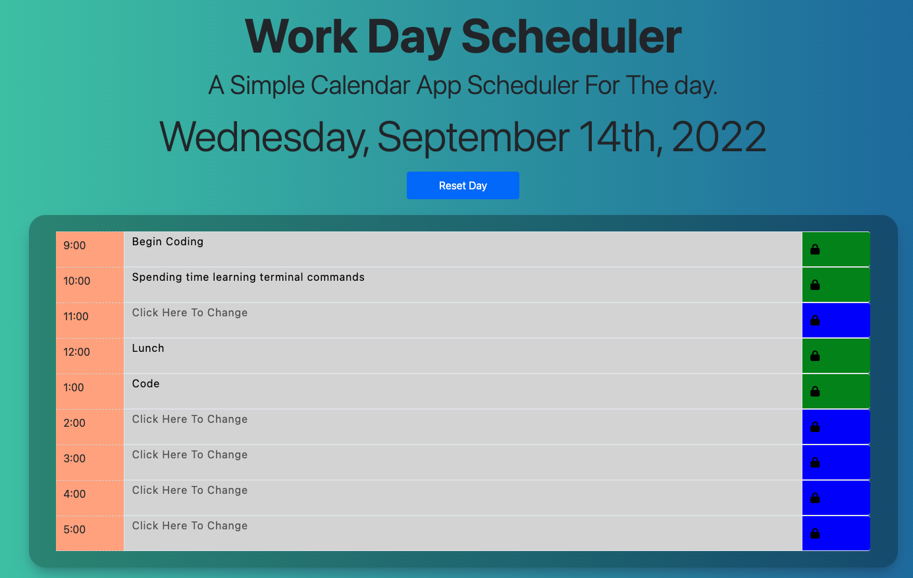

# work-day-scheduler

## Description

This project was to design a simple workday scheduler that would save and recall info from a text input to localstorage.

It was also supposed to use Moment.js, or some other third-party API. I decided to use Date.fns because it didn't have to upload the entire database in order to use it; I could just pull the functions I wanted.

The three colors that I used to signify past, present, and future were gray, red, and light green accordingly.

Once you type into the textarea to change the text and click on the button to save, the button will turn green to signify that it has saved your changes.

If you then type into the same textbox to edit or change your schedule, the button will revert to its blue color to signify that it can then be pressed again to accpet incoming changes.

